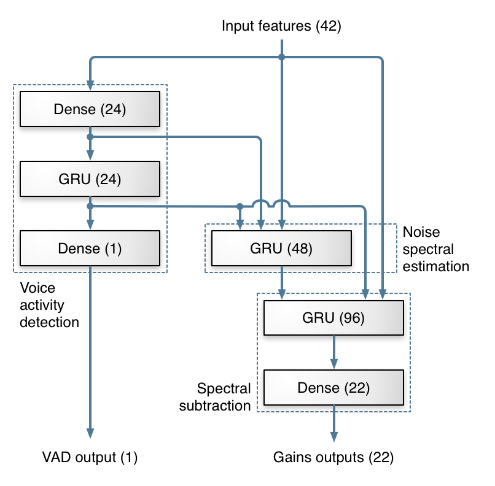

# denoise FPGA

+ 주어진 라이브러리에서 수정한 것  
  + denoise.c  
    + 텍스트 파일에 입력 features와 출력 gain 덤프  
  + demo  
    + 텍스트 파일 초기화

+ frame이란
한번에 처리할 데이터 덩어리.  
( FRAME_SIZE == 480 ) & ( sampling rate == 48000 ) -> ( 1 second == 100 frames )
즉 1초에 100개의 프레임을 처리해야 한다.  

+ feature란  
프레임 당 추출된 특성이다. 이는  

``` C
#define NB_FEATURES (NB_BANDS+3*NB_DELTA_CEPS+2)
```

에 의해 한 프레임당 42개 이다.  

+ gain이란
프레임 당 적용되는 음역대 별 조절 값이다. 이는  

``` C
#define NB_BANDS 22
```

에 의해 22개의 음역대로 쪼개진다. (OPUS)  
  

## 즉  

FPGA 보드는 0.01초마다 42개의 데이터를 입력받고, 22개의 출력을 해야 한다.  
  

+ 첫 실행시 autoconf, libtool 설치 필요  

``` bash
sudo apt-get install autoconf libtool  
```

+ ffmpeg - 음성 데이터의 변환  

``` bat
ffmpeg -i input_wav.wav -f s16le -acodec pcm_s16le -ar 48k input_pcm.pcm  
ffmpeg -f s16le -acodec pcm_s16le -ar 48k -i output_pcm.pcm output_wav.wav  
```

+ Compile  

``` bash
./autogen.sh  
./configure  
make  

./autogen.sh && ./configure && make  
```

+ usage  

``` bash
./examples/rnnoise_demo ./examples/input_pcm.pcm ./examples/output_pcm.pcm  
```

## 한 것  

1. feature와 gain을 바이너리로 저장.  
2. rnn 모델의 verilog 이식.  

## 할것  

1. src/rnn.c 모듈을 verilog로 변환 <- 어느정도 됨.  
2. feature -> FPGA -> gain 통해 노이즈가 제거됨을 확인  
3. feature와 gain은 지금 float이다. 이거를 fpga에서 fixed로 할 지 float으로 할 지.
4. Xilinx에서 이 이진 파일을 읽을 수 있을지... 그리고 다시 이진 파일로 저장할 수 있을지.  
